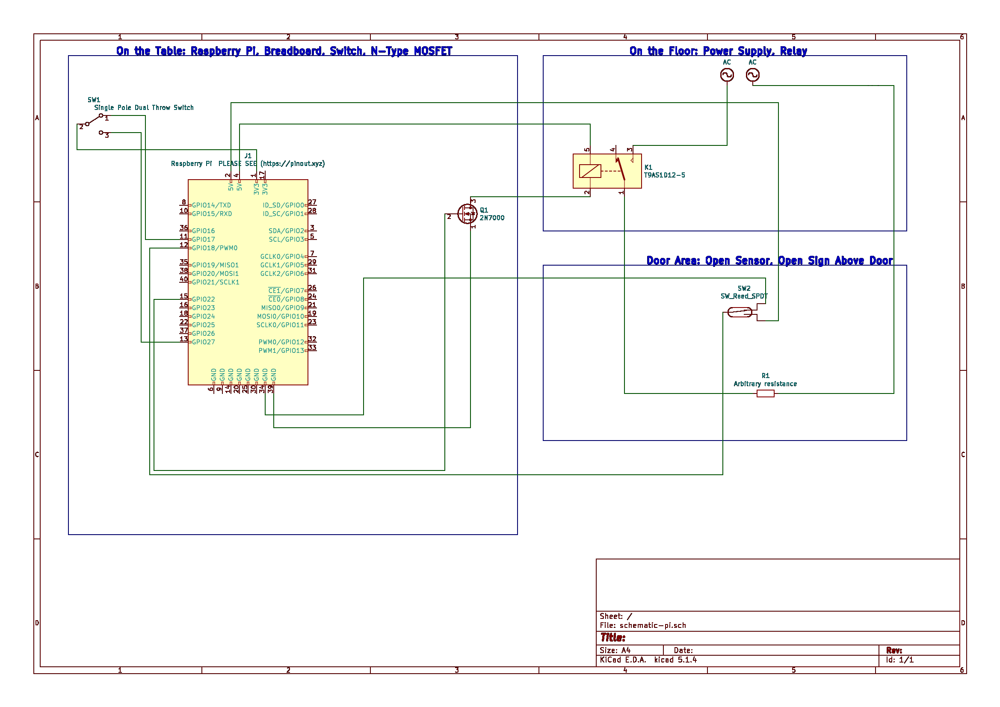

# State Machine
Treating the Design Studio as one grand Moore Machine, exposing outputs to users and mentors.

## input/ (Pure Input)

### magnet_holder.scad

Magnet holder for cylinder magnet

### sunfoundry_sensor_kit.pdf

See Lesson 8 for instructions on Digital Reed Switch sensor usage. Uses magnetic field to determine whether door is open.

### python-ultimaker-api/

Ultimaker http request API in Python written for the Design Studio. Might run into issues with firmware upgrades that invalidate currently available request APIs.

### Not listed

- Cylinder 0.25in x 0.25in (6mm x 6mm) magnet, i.e. [one of these magnets on Amazon](https://www.amazon.com/Personalized-Multi-Use-Whiteboard-Magnetic-Refrigerators/dp/B075PMPKKJ/ref=sr_1_1?keywords=magnet+6x6mm&qid=1568170105&s=gateway&sr=8-1)
- Mentor control DPDT switch (can be SPST)

## machine/ (Input + Output)

### schematic-pi/

KiCad project with a schematic for the state machine's circuitry.

### poller-pi/ 

Physical presence of the state machine in the Design Studio. Bundles sensory inputs into a JSON and sends them to public-endpoint/ over a websocket at / (root) route

### public-endpoint/

[iot.vanderbilt.design](iot.vanderblit.design) (link won't show anything, doesn't serve any actual HTTP stuff)

Websockets server that routes data from the poller-pi to sign/ and site-overrides/ clients. Runs on Heroku, protected behind Cloudflare.

- input
	- / (root) route
		- Receives JSON updates from poller-pi/ 
	- weather.py [wttr.in](https://wttr.in) for current weather
		- sometimes returns gibberish, only displayed if there is a degrees symbol in it
	- mentors.py Google Sheet containing mentor shifts
- output
	- /sign route
		- Serves open status to sign/ clients
	- /printers route
		- Serves printer images to site-overrides/ clients
- logic (main.py)
	- input-dependent
		1. Receive update from poller-pi. If no update received within 30s, proceed with an update containing empty state.
		1. Check if update actually changes the state.
		1. If so, send the updated states to clients connected to output endpoints. Else, do nothing.
		1. Repeat
	- output-dependent
		- client joins
			1. Send current state
			1. Add to keep-alive list
		- client leaves
			1. Remove from keep-alive list
		- keep alive (needed to stop Heroku from dropping long-running connections)
			1. Send current state to all clients every 50s

## output/ (Pure Output)

	- Live Printer Feeds
	- Live Sign Status
	- Current Schedule

### sign/

[sign2.vanderbilt.design](https://sign2.vanderbilt.design)

React single-page progressive web app served by Netlify.

Two outputs:

- Sign as an iframe on [vanderbilt.design](https://vanderbilt.design)
- Fullscreen Chromium tab in Kiosk Mode on Raspberry Pi connected to two monitors
	- This is the same pi as poller-pi/ and driver-pi/

### site-overrides/

Affects main site, [vanderbilt.design](https://vanderbilt.design).

Originally written by @yunyu, various visual improvements/fixes to the Design Studio Wordpress website including but not limited to:

- Add printer live feeds
- Add status sign
- Hide unfriendly youtube video & Vanderbilt social media links
- Make Wordpress theme column-sizes expand/contract properly on desktop and mobile

### driver-pi/

Client of public-endpoint at /sign route that runs on the Pi. Drives MOSFET gate pin to HIGH to activate relay. Changes synchronously with sign/.

### T9A.pdf

T9AS1D12-5 SPST 5VDC Relay used to switch 120VAC for the traditional open sign above the door. 

- Switches black cable connection
- White and green are connected directly

### 2N7000-D.pdf

N-type Signal MOSFET that hooks GND on the Raspberry Pi to the relay. 3.3V I/O pins are not powerful enough to drive the relay so this is needed to do the heavy lifting.
